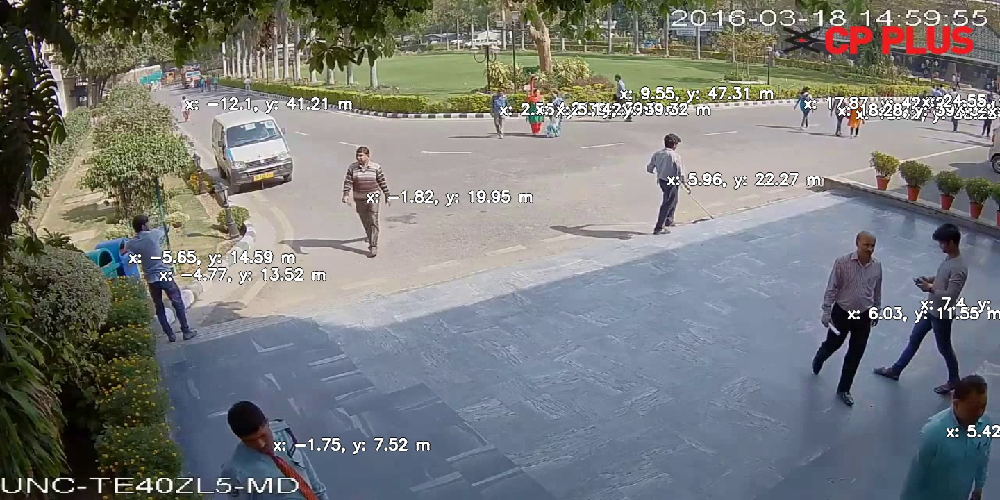
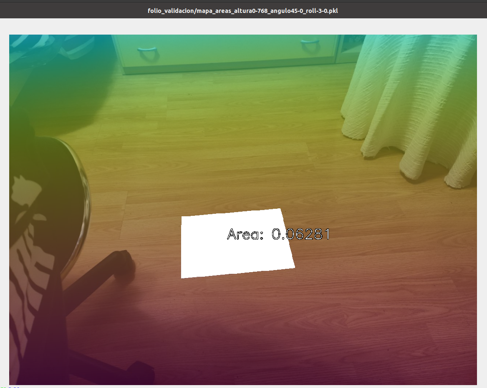
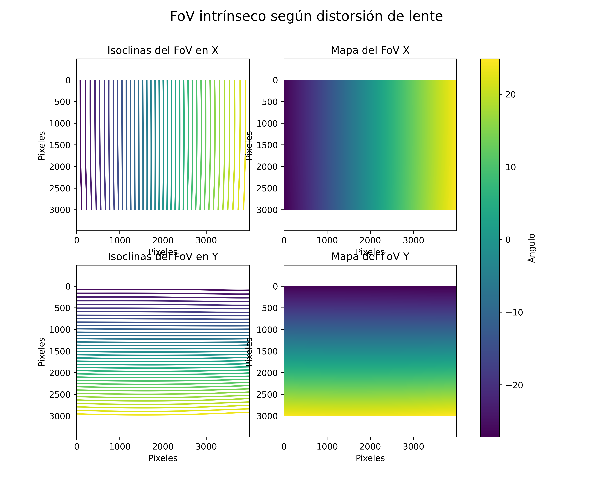
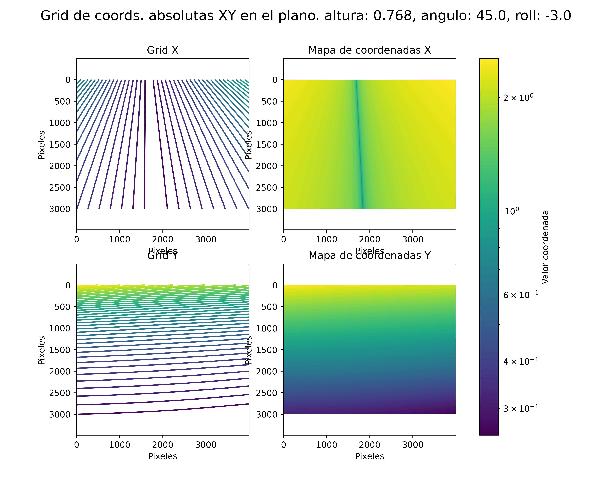
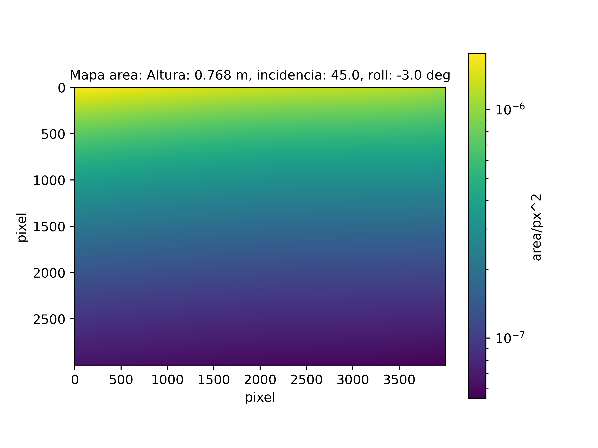
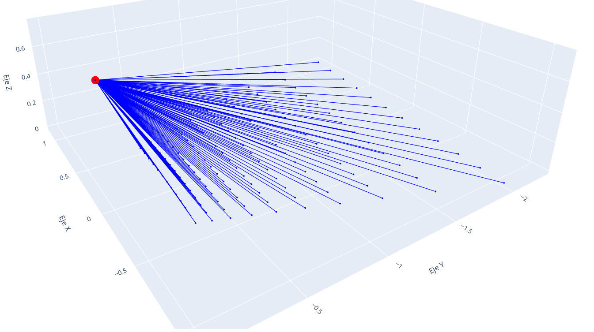

# Plane-measument

This repo offers a way to position and measure distances and areas from a RGB photo from a 2d camera.

## USAGE

1. Calibrate a camera with `opencv-python`. You can use: `cv2.cameraCalibration()` to get the camera matrix an the distortion coeficients.
2. Use the script: `get_position_maps.py` as follows:
```
python3 get_position_maps.py 
    --cfg_path '/path/to/camera_calibration_pickles/' 
    --height 12 
    --angle 45.0 
    --roll 5.3 
    --imgshape 3000 4000
```
Now you have:
- Matrix with the same shape as the original images that stands for the $m^2/px^2$ convertion in every pixel
- Two other matrix with the same shape as the original images that stand for the $x$ and $y$ position of every image's pixel.

## Results

- Position:
- 

- Area


(A4 sheet area is $0.06237\ \mathrm{m^2}$)


## Some plot from calculus

### - Intrinsic camera values:
- Pixel FoV (FIeld of View)
 


### - Extrinsic camera values for a given configuration (dependent on intrinsic parameters):
- Position maps


- Area map:
 

- Visual solution:
 
